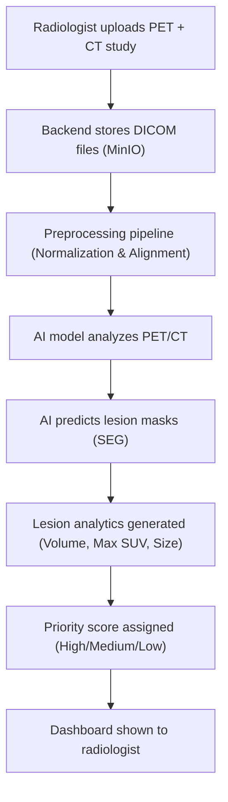

# MedVision AI: Automated Radiology Workflow & Image Analytics Platform

MedVision AI is an asynchronous medical imaging ingestion, visualization, and distributed inference pipeline designed for clinical radiologist workflows. This project is aligned with Siemens-style automated radiology workflow systems.

---

## 🗺️ Project Roadmap & User Workflows

This document serves as the permanent reference for the project phases and the final radiologist workflow.

### 🔄 The Realistic Workflow Reference



---

## 📈 Phase-by-Phase Roadmap

### 🔍 Phase 1: Preprocessing, Analytics, and Ground-Truth Validation
In this phase, we ingest CT, PET, and **Segment (SEG) Labels** (ground truth) together to understand the dataset, validate our alignment pipelines, and design lesion analytics.
*   **Input**: `PET` + `CT` + `SEG` (all uploaded as DICOMs)
*   **Workflow**:
    ```
    Upload PET + CT
          ↓
    AI analyzes scan
          ↓
    AI predicts lesion locations
          ↓
    Generate lesion analytics
          ↓
    Compare against SEG (Ground Truth validation)
          ↓
    Show results to radiologist
    ```
*   **Goal of SEG in Phase 1**:
    *   Understand the Siemens dataset structures.
    *   Validate preprocessing and co-registration (CT/PET/SEG alignment).
    *   Build mathematical calculations for lesion volumes and metabolic metrics.

---

### 🧠 Phase 2: AI Model Training & Inference (Generating SEG)
We train the neural network to output the segmentations automatically. The model learns to map co-registered structural CT and metabolic PET to target tumor/lesion boundaries.
*   **Input**: `PET` + `CT`
*   **Workflow**:
    ```
    PET + CT
       ↓
    AI Model (U-Net / 3D CNN)
       ↓
    Predicted SEG (Generated automatically)
    ```

---

### 🚀 Phase 3: Analytics, Prioritization, & Deployed Dashboard
The automatic predictions from Phase 2 are fed into the analytics engines to prioritize radiologist review order.
*   **Input**: `PET` + `CT`
*   **Workflow**:
    ```
    PET + CT
       ↓
    AI Model
       ↓
    Predicted SEG
       ↓
    Lesion Analytics (Volume, Location, Max SUV)
       ↓
    Priority Score (High/Medium/Low based on severity)
       ↓
    Dashboard
    ```

---

## 🏁 Final Siemens-Aligned User Workflow

When deployed, the radiologist **never** uploads segmentations (SEG). The AI service silently runs inference in the background to handle the detection.

```
Radiologist Uploads PET + CT
            ↓
     DICOM Processing
            ↓
  AI Lesion Segmentation (Auto-predicted)
            ↓
     Lesion Analytics (Calculates e.g. "4 suspicious lesions found, Largest: 2.3 cm³")
            ↓
  Workflow Prioritization (Assigns e.g. "Priority: High")
            ↓
   Radiologist Dashboard (Urgent cases sorted first)
```

| Modality | Needed for Training / Validation? | Needed from Radiologist in Deployed App? |
| :--- | :---: | :---: |
| **CT scan** (`.dcm`) | ✅ Yes | ✅ Yes |
| **PET scan** (`.dcm`) | ✅ Yes | ✅ Yes |
| **SEG Labels** (`.dcm`) | ✅ Yes (Ground Truth) | ❌ No (Predicted by AI) |

---

## 🛠️ Tech Stack & Service Directory
*   **Frontend**: Next.js 14, React 18, Tailwind/Vanilla CSS
*   **Backend API**: FastAPI (Python 3.10+)
*   **Background Jobs**: Celery + Redis
*   **AI Inference**: PyTorch-ready daemon service (`ai-service`)
*   **Storage**: MinIO (S3-compatible) & PostgreSQL 15

## What I Would Tell A Siemens Interviewer
I built a molecular imaging workflow platform that performs PET/CT co-registration, lesion quantification, SUV analysis, connected-component lesion extraction, and interactive radiology visualization. The current version uses expert-provided DICOM-SEG labels for validation, and the architecture is designed to support AI-generated segmentations in future phases.