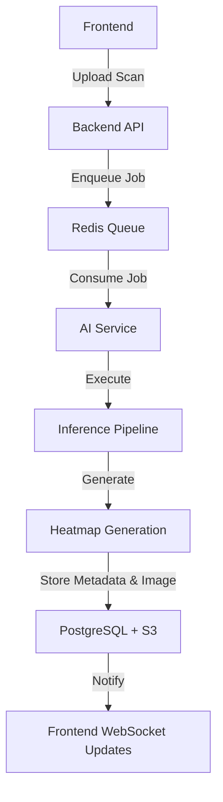

# Async Inference Flow

## Detailed Flow
1. **Frontend**: Client uploads DICOM/Image.
2. **Backend API**: Validates request, saves initial state to database, enqueues task.
3. **Redis Queue**: Acts as message broker to handle asynchronous inference tasks.
4. **AI Service**: Celery worker picks up the job.
5. **Inference Pipeline**: `load -> preprocess -> infer`.
6. **Heatmap Generation**: Explainability module runs Grad-CAM and overlays heatmap.
7. **PostgreSQL + S3**: Results and images are persistently stored.
8. **Frontend WebSocket Updates**: Real-time push notification updates viewer status.
